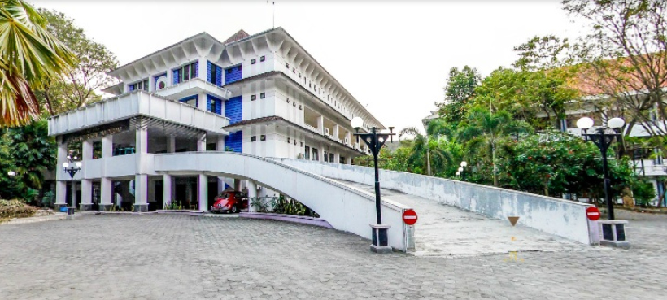
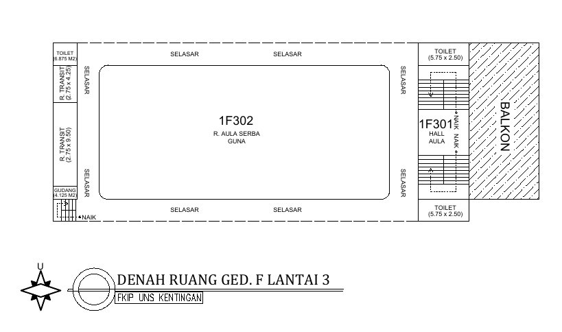
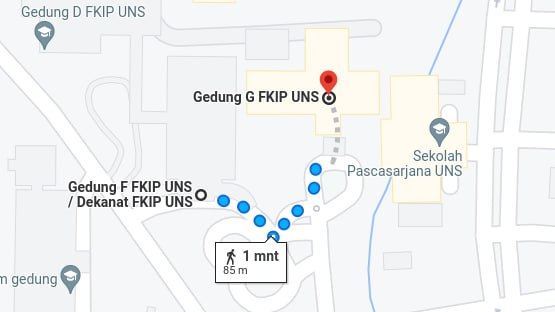

# FKIP UNS Surakarta, Indonesia

- Aula FKIP (Gedung F) UNS, Surakarta, Indonesia
- Building Address: Jalan Ir. Sutami 36A Surakarta, Indonesia 57126




<iframe width="100%" height="350" frameborder="0" scrolling="no" marginheight="0" marginwidth="0" src="https://www.openstreetmap.org/export/embed.html?bbox=110.85452914237976%2C-7.557948352455308%2C110.85703969001771%2C-7.5561110438798655&amp;layer=mapnik&amp;marker=-7.557029699144615%2C110.85578441619873" style="border: 1px solid black"></iframe>

# Campus Map Universitas Sebelas Maret (UNS)
> FKIP - Number 23 https://uns.ac.id/en/about-uns/campus-map/

### Aula FKIP (Gedung F) UNS - 3rd Floor
- (1) Registration & Sponsor booth
- (2) Main Room - For Keynotes, Sponsor Talks, Panel Discussion, and Lightning Talks
- (3) Speaker waiting room
- (4) Toilets

### Class Room (Gedung G) UNS - Distance (±)80m from the Main Room
- (1) Class Room - For Talks (Parallel Class)
- (2) Toilets

# Getting to the venue
See [Tourism](../tourism/) page for details.

# Health and Safety information

To provide safe environment for every participants, We require every participants to read and follow our Code of Conducts ([See **About** page for details](../../about/)). Waering nametags are also required to enter conference area, participate workshop that required seperate registration as well as social activities such as conference dinner and group tour. For people without nametags, We may ask to leave or deny entrance.

## Emergency information

- [Police: 112](tel:112)
- [Fire/Ambulance: 119](tel:119)
- [Travel Helpline: 1330](tel:1330)

### Nearby Prayer Room, Police stations, Fire stations and Hospitals

#### Nurul Huda UNS Mosque (±)800m

- Sebelas Maret University, Kentingan, Jl. Ir Sutami No.36 A, Jebres, Surakarta, Kota Surakarta, Jawa Tengah 57126



#### UNS Campus Church (±)150m

- UNS Universitas Sebelas Maret, Jalan Ir. Sutami No.36 A, Kentingan, Jebres, Surakarta, Kota Surakarta, Jawa Tengah 57126



#### 24시 열린의원 (24/7 Open clinic)
- A **local clinic** Located at **basement floor of the venue**
- [Phone: +82-2-2132-2475](tel:+82-2-2132-2475)





#### Sevrance Hospital
- A **General Hospital** located near Shinchon station
- [Phone: +82-2-337-7582](tel:+82-2-337-7582)





#### Shinchon Yeonsei Hospital
- A **General Hospital** located near Sogang Univ. station
- [Phone: +82-2-1599-1004](tel:+82-2-1599-1004)
- [Phone (from overseas): +82-2-2228-1004](tel:+82-2-2228-1004)




